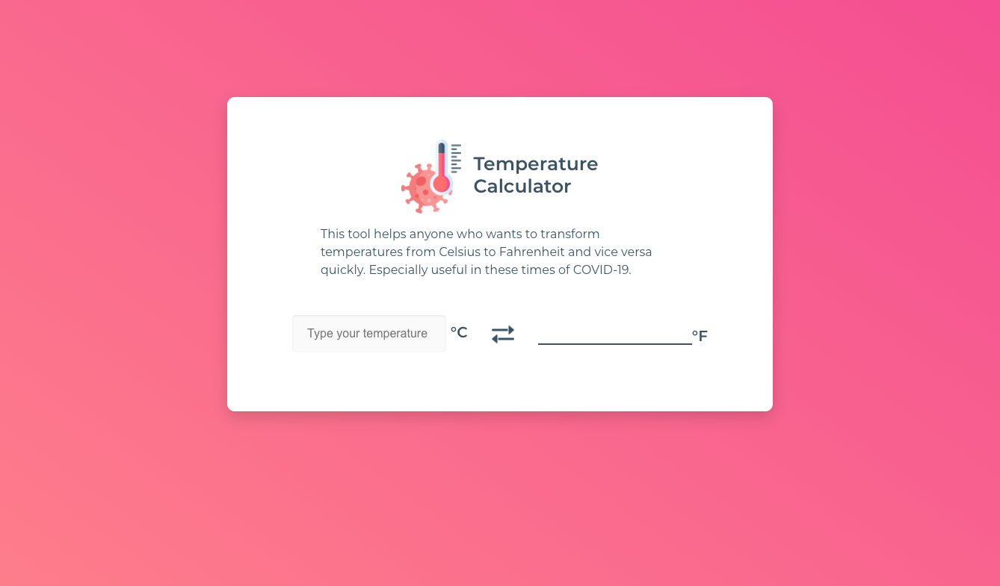

# Temperature Calculator 🧮🌡️

This project is a calculator to convert between temperature in Celsius and Fahrenheit. Was made as a technical task, with the following requirements: 

- [x] The user should be able to enter the temperature to be converted in either direction, i.e. both Celsius -> Fahrenheit and Fahrenheit -> Celsius at any time.
- [x] The calculator should feature basic validation in case an entered value can't be converted
- [x] You are allowed to use any additional libraries as required.

## Design 🎨

It was designed as an app focused on helping to convert temperatures quickly, to help health personnel and people in general in this COVID-19 pandemic.

### Final design:

## Stack 🛠️

- React
- CSS3

## Deploy 🚀

You can use the app [here](http://bdiniscia.github.io/calculator-temperature)

